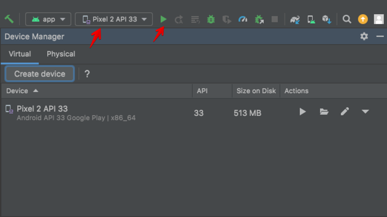

# How to create Android and iOS apps from the NuxtJS application using CapacitorJS

In this guide, I will show how to wrap an existing [NuxtJS](https://v3.nuxtjs.org/) web application in Android and iOS mobile apps using [CapacitorJS](https://capacitorjs.com/)

> Capacitor is an open-source native runtime for building Web Native apps. Create cross-platform iOS, Android, and Progressive Web Apps with JavaScript, HTML, and CSS.

CapacitorJS runs your static site on a local browser and shows it to the user. Also, it has some interface between native and web contexts for accessing native features.

But why do you need this if users can access your website from mobile browsers?

1. It's more useful for users. If a user uses your web app every day, it's easier for him just to click on your app icon than go to the browser and search for your app bookmark or type your app domain name. Both Android and iOS have the feature "Add website to home screen". But a separate native app provides better UX.
2. Distribution channel. Users can search for your app in AppStore and PlayMarket. So, it's better to be present on all popular platforms to reach more users.
3. Native features. Maybe, your web app doesn't need them. But after you create a mobile version of your app, you can change your mind. At least you can add notifications by [FCM](https://firebase.google.com/docs/cloud-messaging).

I think we are done with the "why?" part. Let's go to the "how?" part.

## Creating dummy NuxtJS application 

To simplify this guide, I'll create a new Nuxt application. Feel free to jump to the [Installing CapacitorJS](#Installing CapacitorJS) section if you already have one.

So, let's create a nuxt3 application using the [official guide](https://v3.nuxtjs.org/getting-started/quick-start/). I'll use [NodeJS v16](https://nodejs.org/) and [Yarn v1.22](https://yarnpkg.com/) for installation. 

Open a terminal and run:

```
$ yarn add global nuxi
$ yarn nuxi init nuxt-mobile
$ cd nuxt-mobile
$ yarn install
```


Here we installed [nuxi](https://www.npmjs.com/package/nuxi) Nuxt Command Line Interface, created a new project `nuxt-mobile`, and installed dependencies from `package.json`. You can replace `nuxt-mobile` with any name.

Next, let's change `app.vue`. Replace the existing file with the following one: 

```html
<template>
  <div>
    <h1>Nuxt Mobile</h1>

    <p>This is a basic example of a mobile app built with NuxtJS and CapacitorJS</p>
  </div>
</template>
```

Now, let's see what we got. Run the development server:

```
$ yarn dev -o
```

You will be navigated to the browser. Here you will see your web application.


It's pretty empty, but it will be enough to show how to wrap a web application into mobile apps.

## Installing CapacitorJS


Now, let's add CapacitorJS to the application. I'll follow instructions from the [official guide](https://capacitorjs.com/docs/getting-started):

> In the root of your app, install Capacitor's main npm depdencies: the core JavaScript runtime and the command line interface (CLI).

```
$ yarn add @capacitor/core
$ yarn add --dev @capacitor/cli
```

> Then, initialize Capacitor using the CLI questionnaire:

```
$ yarn cap init
```

The CLI will ask you questions about your package. You can pick any `Name` and `Package` (I used `NuxtMobile` and `com.mycompany.nuxtmobile` values). Then you need to set the `Web asset directory` as `dist`. This is a destination on [NuxtJS static site](https://nuxtjs.org/docs/concepts/static-site-generation/). The CLI will save these answers into `capacitor.config.json` and check the file content.

> After the Capacitor core runtime is installed, you can install the Android and iOS platforms.

```
$ yarn add @capacitor/android @capacitor/ios
```

CapacitorJS uses a static version of the site. So, we need to generate it:

```
$ yarn generate 
```

Now we have a static site so that we can initialize iOS and Android applications:

```
$ yarn cap add android
$ yarn cap add ios
```

These commands create native applications in `android` and `ios` folders. They use clone web content from the `dist` directory to `ios/App/App/public` and `android/app/src/main/assets/public` directories.

Every time you change your site, you need to run `yarn generate` to generate a new static site and `npx cap sync` to update the native apps.

## Running Android app

Let's run the Android application. First, download and install [AndroidStudio](https://developer.android.com/studio). 

After you finish, return to the console and run `yarn cap open android`. This will open `android` folder in AndroidStudio. Here you can change your Android files and run the application. 

Let's add an emulator to run. Go to the "Tools" -> "Device Manager" and click "Create Device." 

First, you need to pick "Hardware device." The main difference between different devices is a screen size and availability of PlayMarket. I'll pick the `Pixel 2` because it has PlayMarket and a 5.0" screen size. 


Then, you need to choose the Android OS image. I will use `Android API 33`.


Finally, click 'Next' and 'Finish'. After this, you will see a new device on the 'Devices' dropdown. 

Now, you can choose your device and click 'Run' to build and start the application:



Android Studio will start the emulator, build, install and run your application:


We are done with Android; let's move to the iOS part.

## Running iOS app

To build the application for iOS, you need a MacBook. If you have Linux or Windows, you can skip this part.

First, you need XCode to build and run the iOS application. You can get it on [AppStore](https://apps.apple.com/us/app/xcode/id497799835).

After installation, return to the console and run `yarn cap open ios`. This command will open the `ios` folder as an XCode project. Here you can change iOS application files and settings; build and run the application.

Now, we need to pick an emulator device to run the application. I'll use the iPod touch.

Then click 'Run'. XCode will build the app and run it on the device.


We are done with the iOS part.

## The end 

Congratulations! In this guide, we turn a new NuxtJS web application into iOS and Android mobile applications. It's a very basic web app so we wouldn't upload it to stores :) But if you already have a full-featured web application, you can turn it into mobile apps and upload them to PlayMarket and AppStore!

You can find the source code of the project [here](https://github.com/eugen1j/nuxt-mobile).

If you need to build a web or mobile app prototype, check out our [website](https://daiquiri.team/services/prototyping?utm_medium=referral&utm_source=dev_to&utm_campaign=nuxt_mobile_1) or connect with me directly on [LinkedIn](https://www.linkedin.com/in/yevhen-bondar/).


